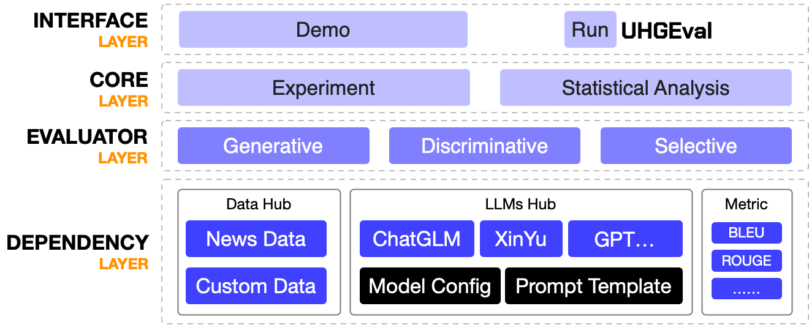
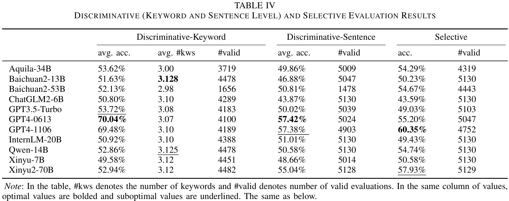
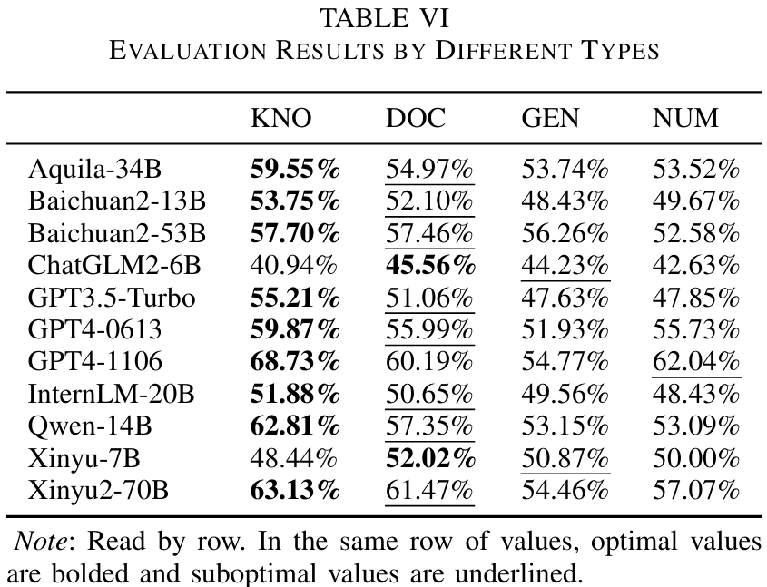

<h1 align="center">
    🍄 UHGEval: Benchmarking the Hallucination of Chinese Large Language Models via Unconstrained Generation
</h1>
<p align="center">
<a href="./uhgeval/"><b>UHGEval</b></a>, a framework designed to evaluate hallucination.<br>
<a href="./data/Xinhua/XinhuaHallucinations.json"><b>XinhuaHallucinations</b></a>, a dataset of hallucination instances.<br>
<a href="https://github.com/IAAR-Shanghai/UHGEval-dataset"><b>UHGEval-dataset</b></a>, the pipeline of creating hallucination dataset.
</p>
<p align="center">
    <a href="https://opensource.org/license/apache-2-0/">
        
    </a>
    <a href="https://arxiv.org/abs/2311.15296">
        
    </a>
    <a href="./data/Xinhua/XinhuaHallucinations.json">
        
    </a>
    <a href="https://github.com/IAAR-Shanghai/UHGEval-dataset">
        
    </a>
</p>

## What's New 🆕

- **2024.02.19**: Fully supported experiment initialization via `config.yaml`.
- **2024.01.14**: Added local model loading for evaluation.
- **2024.01.12**: Supported [TruthfulQA](https://github.com/sylinrl/TruthfulQA) with generative and Multi-Choices evaluation.

<details><summary>Click me to show all TODOs</summary>

- [ ] docs: add video tutorial
- [ ] tests: comprehensive testing
- [ ] contribution: OpenCompass

</details>

## Introduction

UHGEval is a comprehensive framework designed for evaluating the hallucination phenomena in Chinese large language models (LLMs) through unconstrained text generation. Its architecture offers flexibility and extensibility, allowing for easy integration of new datasets, models, and evaluation metrics.

<p align="center"></p>

Additionally, we've made the dataset creation process transparent and accessible through our open-source pipeline, [UHGEval-dataset](https://github.com/IAAR-Shanghai/UHGEval-dataset). This enables researchers to craft customized datasets. UHGEval supports seamless integration of these datasets, facilitating comprehensive evaluations. A prime example is our incorporation of the [TruthfulQA](https://github.com/sylinrl/TruthfulQA) dataset, showcasing the framework's capability to adapt to diverse evaluation needs.

## An Example of XinhuaHallucinations

<details><summary>Click me to show the example</summary>

```json
{
    "id": "num_000432",
    "headLine": "（社会）江苏首次评选消费者最喜爱的百种绿色食品",
    "broadcastDate": "2015-02-11 19:46:49",
    "type": "num",
    "newsBeginning": "  新华社南京2月11日电（记者李响）“民以食为天，食以安为先”。江苏11日发布“首届消费者最喜爱的绿色食品”评选结果，老山蜂蜜等100种食品获得消费者“最喜爱的绿色食品”称号。",
    "hallucinatedContinuation": "江苏是全国绿色食品生产最发达的省份之一。",
    "generatedBy": "InternLM_20B_Chat",
    "appearedKeywords": [
        "江苏",
        "全国",
        "绿色食品生产"
    ],
    "allKeywords": {
        "江苏": "合理",
        "全国": "合理",
        "绿色食品生产": "合理",
        "发达": "不合理，没有事实证明江苏是全国绿色食品生产发达的省份，但可以确定的是，江苏在绿色食品生产上有积极的实践和推动",
        "省份": "合理",
        "之一": "不合理，没有具体的事实证据表明江苏是全国绿色食品生产发达的省份之一"
    },
    "realContinuation": "61家获奖生产企业共同签署诚信公约，共建绿色食品诚信联盟。",
    "newsRemainder": "61家获奖生产企业共同签署诚信公约，共建绿色食品诚信联盟。这是江苏保障食品安全、推动绿色食品生产的重要举措。\n  此次评选由江苏省绿色食品协会等部门主办，并得到江苏省农委、省委农工办、省工商局、省地税局、省信用办、省消协等单位大力支持。评选历时4个多月，经企业报名、组委会初筛、消费者投票等层层选拔，最终出炉的百强食品榜单由消费者亲自票选得出，网络、短信、报纸及现场投票共310多万份票数，充分说明了评选结果的含金量。\n  食品安全一直是社会关注的热点。此次评选过程中，组委会工作人员走街头、进超市，邀请媒体、消费者、专家深入产地开展绿色食品基地行，除了超市选购外，还搭建“诚信购微信商城”“中国移动MO生活绿色有机馆”等线上销售平台，开创江苏绿色食品“评展销”结合新局面。评选不仅宣传了江苏绿色品牌食品，更推动了省内绿色食品市场诚信体系的建立，为江苏绿色食品走向全国搭建了权威的平台。\n  江苏省农委副主任李俊超表示，绿色食品消费是当前社会重要的消费趋势。本次评选不仅为社会培育了食品安全诚信文化，也提高了消费者对食品质量和标识的甄别能力，实现了消费者和生产企业的“双赢”。\n  与会企业表示，能够入选“首届江苏消费者最喜爱的绿色食品”是消费者的信任和支持，他们将以此荣誉作为企业发展的新起点，严把食品质量关，推介放心安全的绿色品牌食品，促进产业稳定健康发展。（完）"
}
```

</details>

## Project Structure

```bash
.
├── .github
├── .gitignore
├── CITATION.bib
├── LICENSE
├── README.md
├── README.zh_CN.md
├── archived_experiments    # Experiment results no longer in active use
├── assets                  # Static files like images used in documentation
├── config.yaml             # Configuration file for initializing experiments
├── data                    # Datasets (e.g., XinhuaHallucinations)
├── demo.py                 # A demonstration script showcasing the project's capabilities
├── logs                    # Errors, warnings, information, etc.
├── output                  # Stores the results of evaluations
├── requirements.txt
├── run_uhgeval.py          # Script to run the evaluation
├── run_uhgeval_future.py   # Script to run the evaluation
├── statistics              # Holds summary results of multiple experiments
├── tests                   # Contains unit testing scripts
└── uhgeval                 # Source code for the project
    ├── .cache              # Cache folder for storing temporary data or scripts
    ├── configs             # Scripts for initializing model loading parameters
    ├── core                # Core scripts for data analysis and experiment orchestration
    ├── dataset             # Scripts for dataset loading
    ├── evaluator           # Scripts for performing evaluation tasks
    ├── llm                 # Scripts for loading and interacting with LLMs
    ├── metric              # Defines evaluation metrics
    └── prompts             # Prompt Engineering
```

## Quick Start

1. Ensure you have Python 3.10.0+
2. `pip install -r requirements.txt`
3. Prepare your model configuration file:
    - Use [`uhgeval/configs/example_config.py`](uhgeval/configs/example_config.py) as a template.
    - Create a new file `uhgeval/configs/real_config.py`.
    - In this new file, specify configurations for the models you wish to evaluate, including details like the model's name, type, token, private key, etc.

For a quick demonstration:

- Execute [`demo.py`](demo.py). 
- Note: An OpenAI API key is necessary for running the demo.

To fully leverage the UHGEval framework:

- Reference [`config.yaml`](config.yaml) to adjust configurations for both datasets and models you want to evaluate on.
- Execute the evaluation with `python run_uhgeval.py --conf=config.yaml`.

## Results for Experiment-20231117

<p align="center"></p>

<p align="center"></p>

<p align="center"></p>

The original experimental results are in [./archived_experiments/20231117](./archived_experiments/20231117).

## Customization Guidelines

### Adding New Datasets
- **Place Dataset Files**: Add your dataset files under `data/dataset_name/`, e.g., `data/MyDataset/A.json`.
- **Implement Loader Script**: Create a script for loading your dataset at `uhgeval/dataset/loadMyDataset.py`.

### Integrating New Models
- **Identify Model Type**: Determine how your model is loaded (API, local, etc.).
- **Add Model Loader**:
  - For API models: `uhgeval/llm/apiModelLoader.py`.
  - Adapt the path based on the model type.

### Creating Custom Metrics
- **Implement Metric**: Add your metric implementation in `uhgeval/metric/`.

### Developing New Evaluators
- **Implement Evaluator**: Craft your evaluator script, ensuring it aligns with the structure of `base.py`, and place it at `uhgeval/evaluator/yourEvaluator.py`.
- **Model Interaction Method**: Introduce a method for model interaction in `uhgeval/llm/base.py`.
- **Prepare Prompt Files**: Create prompt files for your evaluator at `uhgeval/prompts/yourPrompts.txt`.

## Contribution Guidelines

Although we have conducted thorough automatic annotation and manual verification, there may still be errors or imperfections in our [XinhuaHallucinations](./data/Xinhua/XinhuaHallucinations.json) dataset with over 5000 data points. We encourage you to raise issues or submit pull requests to assist us in improving the consistency of the dataset. You may also receive corresponding recognition and rewards for your contributions.

You can also contribute to the project by adding new datasets, integrating new models, creating custom metrics, or developing new evaluators. We welcome all forms of contributions.

> [!Note]
> Remember to read the [Contribution Guidelines](./.github/CONTRIBUTING.md) before creating a pull request!

## Citation

```BibTeX
@article{UHGEval,
    title={UHGEval: Benchmarking the Hallucination of Chinese Large Language Models via Unconstrained Generation},
    author={Xun Liang and Shichao Song and Simin Niu and Zhiyu Li and Feiyu Xiong and Bo Tang and Zhaohui Wy and Dawei He and Peng Cheng and Zhonghao Wang and Haiying Deng},
    journal={arXiv preprint arXiv:2311.15296},
    year={2023},
}
```
