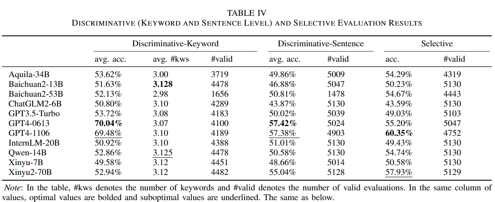
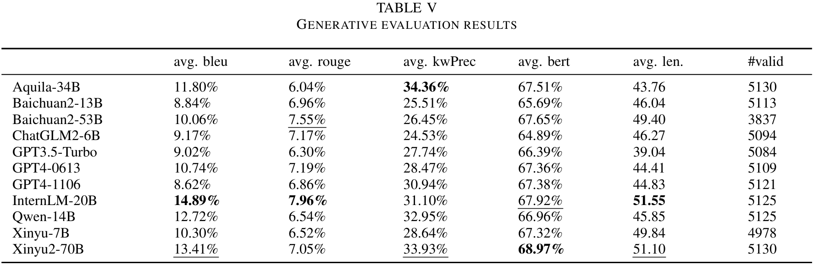
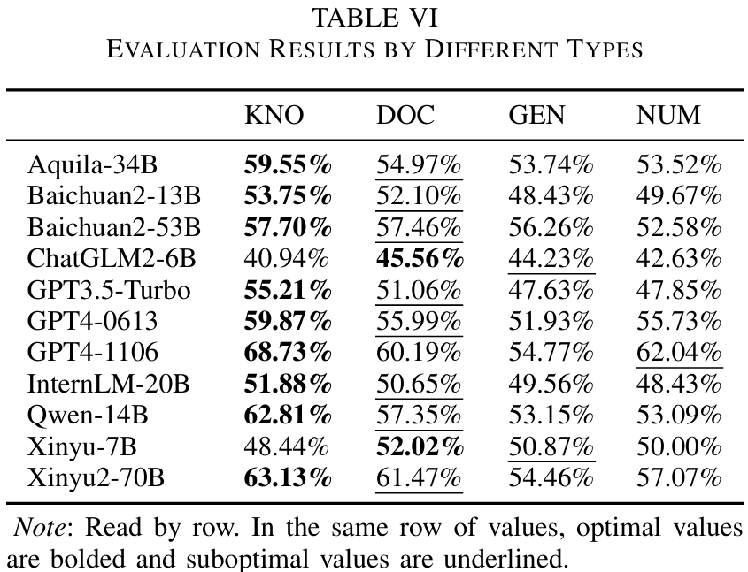

# Experiments

## Experiment-20231117

These are the experimental results corresponding to the [ACL 2024 paper](https://aclanthology.org/2024.acl-long.288/). All evaluations were conducted on the full version of the UHGEvalDataset.

The original experimental can be found in [./experiments/20231117](./experiments/20231117).

> [!Caution]
> The Eval Suite used at that time was an older version. Running the same experiments with the current version might produce slightly different results.
